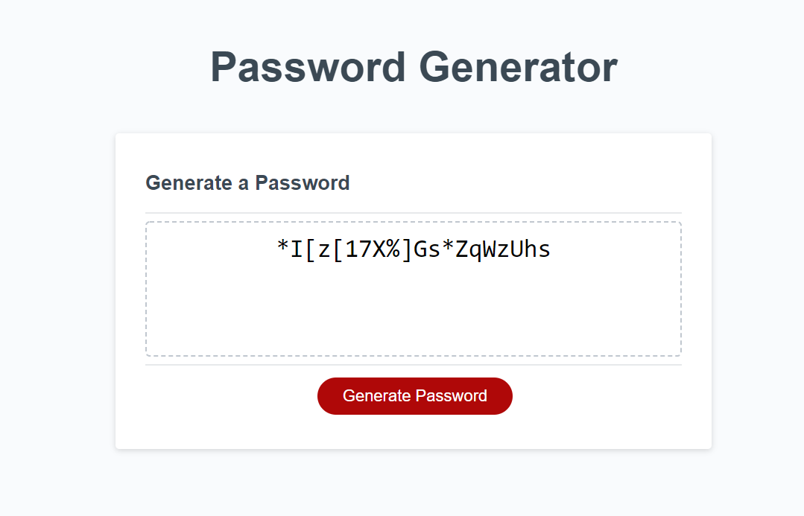

# Challenge-3

This is the third challenge of my UW coding bootcamp curriculum.

For this challenge, we had to follow the acceptance criteria to generate a random password after a series of prompts and user inputs.

The user is prompted to input how long they would like the password to be, as well as if they would like to include uppercase and lowercase letters, special characters, and numbers.

If the choices are inputted correctly the function should return random password pulled from several arrays.

This code was developed using starter code. Only javascript was added upon.

View a screenshot of the generator below

View the deployed site [Here:](https://noahbrown26.github.io/Challenge-3/)

